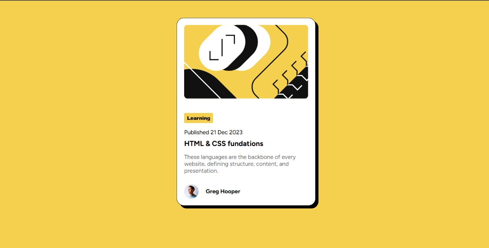

# Frontend Mentor - Blog preview card solution

This is a solution to the [Blog preview card challenge on Frontend Mentor](https://www.frontendmentor.io/challenges/blog-preview-card-ckPaj01IcS). Frontend Mentor challenges help you improve your coding skills by building realistic projects. 

## Table of contents

- [Overview](#overview)
  - [The challenge](#the-challenge)
  - [Screenshot](#screenshot)
  - [Links](#links)
- [My process](#my-process)
  - [Built with](#built-with)
  - [What I learned](#what-i-learned)
  - [Continued development](#continued-development)
  - [Useful resources](#useful-resources)
- [Author](#author)
- [Acknowledgments](#acknowledgments)

## Overview

### The challenge

Users should be able to:

- See hover and focus states for all interactive elements on the page

### Screenshot

### Links

- Solution URL: https://blog-preview-card-fem-beryl.vercel.app/

## My process

### Built with

- Semantic HTML5 markup
- CSS custom properties
- Flexbox
- Mobile-first workflow

### What I learned

I have learned how to deal whit the size of the image doing the mobile view.

### Continued development

I will defenitly still working in my css habilities, i have a lot to learn yet. 

## Author

- Website - [Gaston Riecan](https://gaston-riecan-portafolio.vercel.app/)
- Frontend Mentor - [@GastonRiecan](https://www.frontendmentor.io/profile/GastonRiecan)

## Acknowledgments

Its so so important understand that is a bad idea put stritct width and height in a div or img.
